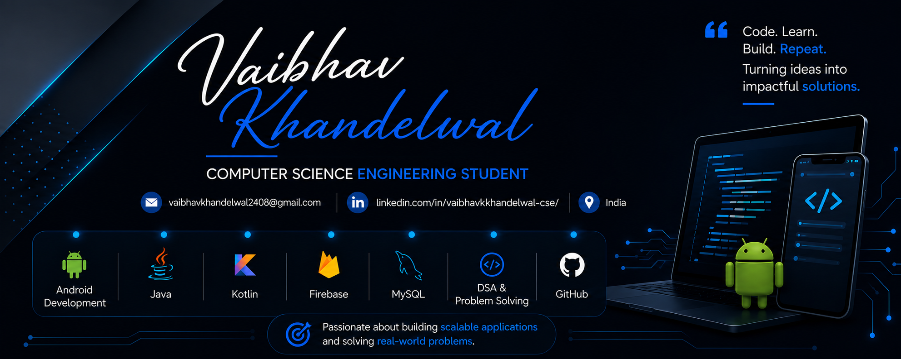

  

# Hi, I'm Vaibhav Khandelwal 👋

## Introduction
Computer Science Engineering student at JUIT with a strong interest in Android Development, Data Structures & Algorithms, and Software Engineering.

- 🎓 CSE Undergraduate at JUIT
- 💻 Building Android applications with Java, Kotlin, XML, and Firebase
- 🌱 Currently learning System Design and Backend Development
- 📚 Solving DSA problems regularly
- 🎯 Seeking internship and placement opportunities
- 📫 Reach me at: vaibhavkhandelwal2408@gmail.com

# 💻 Tech Stack:
        

## 📊 GitHub Stats

  

  

  

## Graph

## 💻 Coding Profiles

  

  

## 🚀 Featured Projects

### 🍔 Food Wheels – Two-Way Android Food Ordering System
**Tech Stack:** Kotlin • Firebase • Android Studio • XML

Developed a dual-application food ordering ecosystem with dedicated interfaces for customers and administrators.

**Highlights**
- 🔐 Firebase Authentication for secure login and session management
- ⚡ Realtime order synchronization using Firebase Realtime Database
- 📦 Order placement, tracking, and status monitoring
- 🛠 Admin dashboard for menu and order management
- 📱 Responsive Android UI with role-based functionality

---

### 🏨 LuxeManage – Hotel Management System
**Tech Stack:** Java • JDBC • MySQL

Designed a hotel management platform for reservations, billing, and guest record handling.

**Highlights**
- 🏷 Booking and room allocation management
- 💳 Automated billing workflows
- 🗄 MySQL integration using JDBC
- 📊 Managed 100+ simulated guest records
- 🔍 Search and retrieval functionalities

---

### 🌾 Smart Farming Assistance Application
**Tech Stack:** Kotlin • Android Studio • XML

Built an Android application to support farmers with data-driven agricultural insights.

**Highlights**
- ☁ Weather forecasting module
- 📈 Market price comparison across 200+ mandis
- 🌱 Crop recommendation workflows
- 🌐 Multilingual accessibility
- 📶 Offline support for low-connectivity environments

## 🏆 Achievements

- 🎓 **CGPA:** 9.1+
- 💻 **300+ DSA Problems Solved** across LeetCode and CodeChef
- 📱 Developed multiple Android applications using Kotlin, Firebase, and XML
- 👥 Leadership experience as **Head of PR, The Joust**
- 🌱 Passionate about Open Source and continuous learning

## 📫 Connect With Me

---

<!-- Proudly created with GPRM ( https://gprm.itsvg.in ) -->
